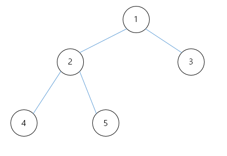
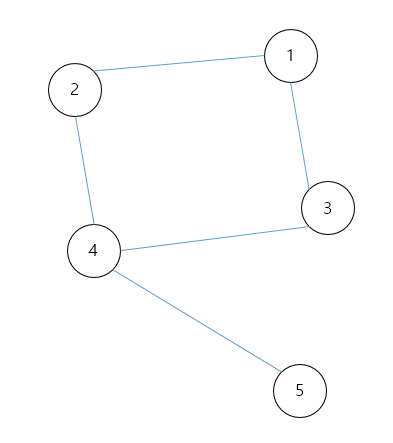
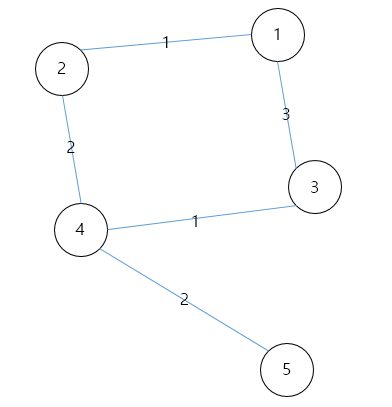
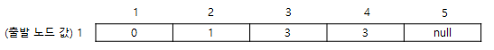
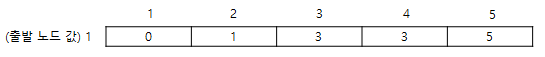
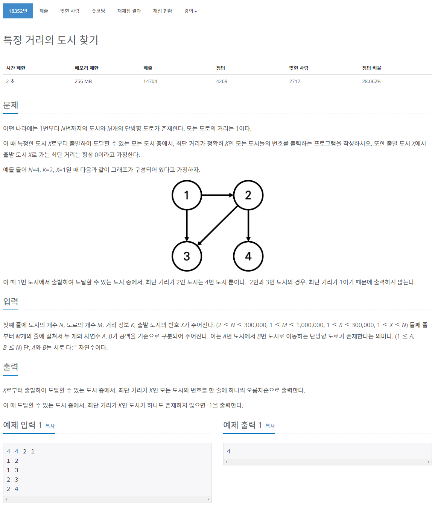

# 정의
## Dijkstra
> DP를 활용한 대표적인 최단경로 알고리즘
> 
> 그래프에서 한 정점에서 다른 정점으로 가는 최단 경로를 찾는 알고리즘
> 
> 음의 간선을 포함하지 않음 -> 현실세계에 가장 적합

<br>
<br>

# 상황
## 이진 트리


==> DFS, BFS

<br>
<br>

## 트리


<br>
<br>

# 알고리즘

> 1. 출발 노드 설정
> 2. 출발 노드를 기준으로 각 노드의 최소 비용을 저장
> 3. 방문하지 않은 노드 중에서 가장 비용이 적은 노드를 선택
> 4. 해당 노드를 거쳐서 특정한 노드로 가는 경우르 고려하여 최소 비용을 갱신
> 5. 위 과정을 3번 ~ 4번 반복

<br>
<br>



<br>
<br>

### 1번 노드 방문


<br>
<br>

### 2번 노드 방문



<br>
<br>

### 3번 노드 방문


<br>
<br>

### 4번 노드 방문



<br>
<br>

# 구현
```
#include <stdio.h>

int number = 5;

// 전체 그래프 초기화
int a[5][5] = {
  {0, 1, 3, null, null},
  {1, 0, null, 2, null},
  {3, null, 0, 1, null},
  {null, 2, 1, 0, null},
  {null, null, null, 2, 0},
}
bool v[6]; // 방문한 노드
int d[6];  // 거리

// 가장 최소 거리를 가지는 정점 반환
int getSmallIndex() {
  int min = max_int;
  int index = 0;

  for(int i = 0; i < number; i++) {
    if(d[i] < min && !v[i]) {
      min = d[i];
      index = i;
    }
  }
  return index;
}

// 다익스트라 알고리즘
void dijkstra(int start) {
  // 출발 노드에서의 값 초기화
  for(int i = 0; i < number; i++) {
    d[i] = a[start][i];
  }
  v[start] = true;

  for(int i = 0; i < number - 2; i++) {
    // 최소값 노드 찾기
    int current = getSmallIndex();
    v[current] = true;
    
    // 최소값 노드에서 최단 경로값 찾기
    for(int j = 0; j < 5; j++) {
      if(!v[j]) {
        if(d[current] + a[current][j] < d[i]) {
          d[j] = d[current] + a[current][j];
        }
      }
    }
  }
}

int main(void) {
  dijkstra(0);

  // 출력
  for(int i = 0; i < number; i++) {
    print("%d ", d[i]);
  }
}
```

<br>
<br>
<br>

# 예제
[백준 18352번 특정 거리의 도시 찾기][(https://www.acmicpc.net/problem/2606](https://www.acmicpc.net/problem/18352)) (실버 2)

<br>



<br>
<br>

## 풀이

할까말까?